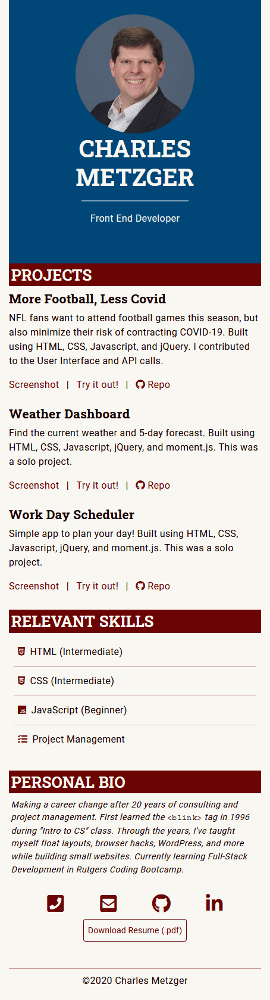

# Personal portfolio

This portfolio was developed to share some coding projects and contact information.
https://github.com/cmetzjr/cmetzjr.github.io

## Technology

The app uses HTML, CSS, JavaScript, and jQuery. The site is responsive and was developed using "mobile-first" techniques.

The overall layout uses CSS Grid instead of Bootstrap's grid system. That allows the source order of sections to change at different breakpoints. Bootstrap is used to style other components, as well as for modals and tooltips. Bootstrap's Flexbox grid is also used for a subsection of the page.

## Screenshots
Mobile view: 

Desktop view: 

